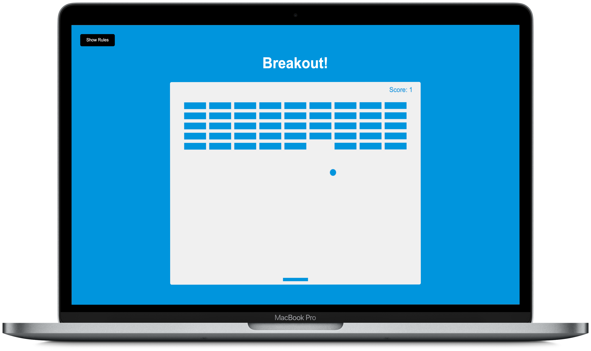

# Breakout game
🏓  A breakout game where you control a paddle with arrow keys to bounce a ball up to break bricks built in 🍦vanilla JavaScript, HTML, CSS, and the HTML5 canvas element and API.
- Draw elements on canvas
- Use canvas paths to draw shapes
- Add animation with requestAnimationFrame(cb)
- Move paddle on arrow key press
- Add collision detection
- Keep score
- Add rules button with slider

## Table of Contents

- [Getting Started](#getting-started)
- [Tech Stack](#tech-stack)
- [Author](#author)

## Getting Started

1. Fork or directly clone this repository to your local machine and `cd` 
2. Right click on `index.html` and open directly in the browser _or_ with VSCode's Live Sever extension. 

## Tech Stack

- [javascript](https://developer.mozilla.org/en-US/docs/Web/JavaScript)
- [css](https://developer.mozilla.org/en-US/docs/Web/CSS)
- [html](https://developer.mozilla.org/en-US/docs/Web/HTML)
- [canvas-api](https://developer.mozilla.org/en-US/docs/Web/API/Canvas_API)

## Author

- [Olympia Wojcik](https://github.com/olympiawoj)